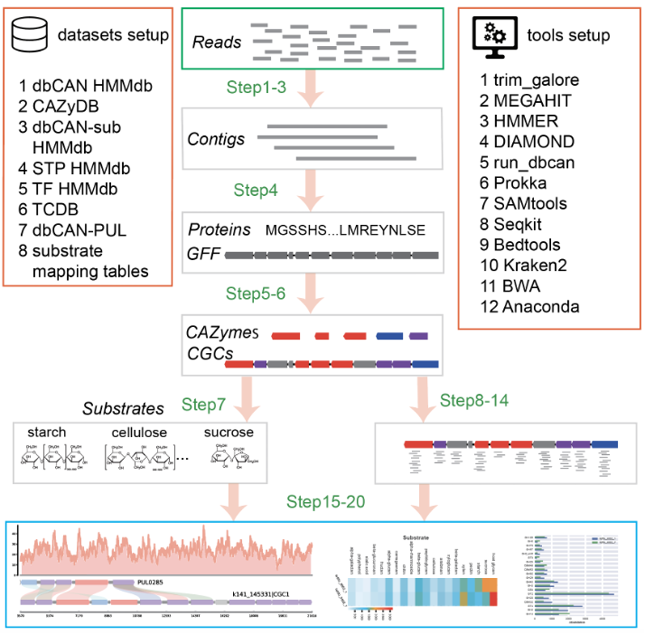
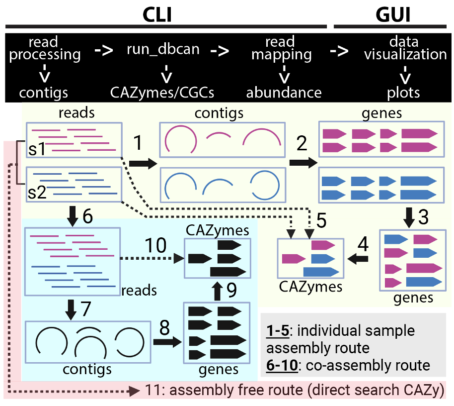

Run from Raw Reads: Automated CAZyme and Glycan Substrate Annotation in Microbiomes: A Step-by-Step Protocol
============================================================================================================

Introduction
------------

Overview
-----------

In this tutorial, we present a comprehensive protocol to annotate CAZymes and glycan substrates in microbiome datasets. Using a real-world microbiome dataset, this guide will walk you through each step of the computational workflow for analyzing occurrence and abundance. The workflow, depicted in Fig. 1, is designed to be user-friendly and does not require extensive programming knowledge.



.. figure::

   Fig.1 <strong>Overview of the protocol</strong>


Workflow Steps
-----------``````

1. **Pre-Processing of Raw Sequencing Reads:** 
   Begin with the preprocessing of raw sequencing reads. This includes the removal of contaminants, adapter sequences, and trimming of low-quality reads. We'll use `trim_galore` and `Kraken2` for this purpose (Steps 1-2).

2. **Contig Assembly:** 
   The clean reads from each sample are then assembled into contigs using `MEGAHIT` (Step 3).

3. **Gene Model Annotation:** 
   These contigs are subsequently passed to `Prokka` for gene model annotation (Step 4).

4. **CAZyme and CGC Annotation:** 
   The next phase involves annotating the contigs for CAZymes and CGCs. This is achieved by `run_dbcan`, utilizing the protein sequence (faa) and gene annotation (gff) files produced by `Prokka` (Step 5).

5. **Location Mapping and Substrate Prediction:** 
   Step 6 involves mapping the location of annotated CAZymes and CGCs on the contigs. In Step 7, `run_dbcan`'s substrate prediction function infers glycan substrates for these CAZymes and CGCs.

6. **Abundance Calculation:** 
   To quantify the abundance of CAZymes, substrates, and CGCs, clean reads from Step 2 are mapped to the nucleotide coding sequences (CDS) of proteins from Step 4 (Steps 8-14).

7. **Data Visualization:** 
   Finally, steps 15-20 focus on visualizing the occurrence and abundance results. We provide Python scripts for creating publication-quality plots in PDF format.




.. |centered-text2| raw:: html

   Fig.2 <strong>Experimental design of CAZyme annotation in microbiomes</strong>

|centered-text2|

User Requirements
----------------------`

This protocol is designed for users who are comfortable with the Linux command-line interface and can execute Python scripts in the terminal. While extensive programming experience is not necessary, users should be familiar with editing Linux commands and plain-text scripts within a command-line environment.

Equipment
---------

Operating System
----------------------

All the modules of this protocol (Fig. 2) are designed to run on a command line (CLI) environment with a Linux OS (e.g., Ubuntu). 
We recommend users install these modules and execute all commands on a high-performance Linux cluster or workstation with >32 CPUs 
and 128GB of RAM instead of a laptop, as the assembly of raw reads has a high demand of CPU and RAM. 

Once users finish the data visualization module (Fig. 2), the resulting image files (PDF format) can be copied 
to a desktop or laptop with GUI for data visualization. In practice, users can choose not to use our read processing 
module and read mapping module. They may instead use their preferred tools for preparing input data for run_dbcan module 
and for calculating abundance for CAZymes and substrates. In that case, they can skip the installation of our read processing 
module and read mapping module in this protocol.

Data Files
-----------``

The example dataset (Carter2023) is described above and detailed in Table 2. 
The raw read data, intermediate data from each analysis step, and final result 
data and visualization files are organized in nested folders available on our 
website https://bcb.unl.edu/dbCAN_tutorial/dataset1-Carter2023/, Fig. 5) and 
https://dbcan.readthedocs.io. These websites also include data files and 
protocols for two additional example datasets (Wastyk202122 and Priest202362), 
which are not included in this protocol paper. We will use the independent sample 
assembly route for Carter2023 in the main text to demonstrate all the commands. 
Commands for the other routes are provided Supplementary Protocols. 

Software and versions
----------------------`````

- **Anaconda** (`Anaconda <https://www.anaconda.com>`_, version 23.7.3)
- **MEGAHIT** (`MEGAHIT <https://github.com/voutcn/megahit>`_, version 1.2.9)
- **BWA** (`BWA <https://github.com/lh3/bwa>`_, version 0.7.17-r1188)
- **HMMER** (`HMMER <http://hmmer.org/>`_, version 3.3)
- **DIAMOND** (`DIAMOND <https://github.com/bbuchfink/diamond>`_, version 2.1.8)
- **BLAST** (`BLAST <https://ftp.ncbi.nih.gov/blast/>`_, version 2.14)
- **TrimGalore** (`TrimGalore <https://github.com/FelixKrueger/TrimGalore>`_, version 0.6.0)
- **Prokka** (`Prokka <https://github.com/tseemann/prokka>`_, version 1.4)
- **Samtools** (`Samtools <https://github.com/samtools/samtools>`_, version 1.7)
- **Seqkit** (`Seqkit <https://bioinf.shenwei.me/seqkit/>`_, version 2.5.1)
- **Bedtools** (`Bedtools <https://bedtools.readthedocs.io/en/latest/>`_, version 2.27.1)
- **Kraken2** (`Kraken2 <https://ccb.jhu.edu/software/kraken2/>`_, version 2.1.1)
- **run_dbcan** (`run_dbcan <https://github.com/linnabrown/run_dbcan>`_, version 4.0.0)
- **BBTools** (`BBTools <https://jgi.doe.gov/data-and-tools/software-tools/bbtools/>`_, version 37.62)
- **Seqkt** (`Seqkt <https://github.com/lh3/seqtk>`_, version 1.2-r94)
- **Minimap2** (`Minimap2 <https://github.com/lh3/minimap2>`_, version 2.26-r1175)
- **Flye** (`Flye <https://github.com/fenderglass/Flye>`_, version 2.9.3-b1797)
- **Mmseqs2** (`Mmseqs2 <https://github.com/soedinglab/MMseqs2>`_, release 15-6f452)

Anaconda as the Software Management System
-------------------------------------------------------``
Anaconda will be used as the software package management system for this 
protocol. Anaconda uses the ``conda`` command to create a virtual 
environment to facilitate the easy installation of software packages 
and running command line jobs. With the conda environment, users do 
not need to worry about the potential issues of package dependencies 
and version conflicts.

Like in all bioinformatics data analysis tasks, we recommend users organize
their data files by creating a dedicated folder for each data analysis 
step.

Installation and Data Preparation
---------------------------------

S1. Download Carter2023 (Table 2) raw reads (~10min)
------------------------------------------------------------------`````
To download the required raw reads, use the following wget commands:

.. code-block:: shell

    wget https://bcb.unl.edu/dbCAN_tutorial/dataset1-Carter2023/individual_assembly/Dry2014_1.fastq.gz
    wget https://bcb.unl.edu/dbCAN_tutorial/dataset1-Carter2023/individual_assembly/Dry2014_2.fastq.gz
    wget https://bcb.unl.edu/dbCAN_tutorial/dataset1-Carter2023/individual_assembly/Wet2014_1.fastq.gz
    wget https://bcb.unl.edu/dbCAN_tutorial/dataset1-Carter2023/individual_assembly/Wet2014_2.fastq.gz

These raw data were originally downloaded from 
https://www.ncbi.nlm.nih.gov/sra/?term=ERR7745896 
and https://www.ncbi.nlm.nih.gov/sra/?term=ERR7738162 
and renamed to indicate their collected seasons (Table 2). 

S2. Install Anaconda (~3min)
---------------------------------````

Download and install the latest version of Anaconda for Linux from
https://www.anaconda.com/download#downloads. Once Anaconda is 
successfully installed, proceed to create a dedicated conda environment 
named `CAZyme_annotation` and activate it. 
Subsequently, all the required tools can be seamlessly installed within 
this environment. 

.. code-block:: shell

    conda create -n CAZyme_annotation python=3.9
    conda activate CAZyme_annotation

S3. Install all bioinformatics tools (~10min)
-------------------------------------------------------`````

.. code-block:: shell

    conda install -c conda-forge -c bioconda -c defaults prokka -y
    conda install -c bioconda megahit trim-galore -y
    conda install -c bioconda blast bwa diamond -y
    conda install -c bioconda hmmer -y
    conda install -c bioconda samtools bedtools seqkit -y 
    conda install -c bioconda kraken2 -y
    conda install -c agbiome bbtools
    conda install -c bioconda seqtk flye minimap2
    conda install -c conda-forge -c bioconda mmseqs2
    conda install dbcan -c conda-forge -c bioconda

Alternatively, users can run a single configuration file dbcan.yml 
(replace S2 and S3) that streamlines the above 
configuration of all the essential software required for this protocol.

.. code-block:: shell

    git clone https://github.com/linnabrown/run_dbcan.git
    cd run_dbcan
    conda env create -f dbcan.yml
    conda activate CAZyme_annotation

S4. Configure databases required by run_dbcan (~2h)
------------------------------------------------------------------````
To install the databases, execute the following commands:

.. include:: database_preparation.rst

Download database required by Kraken2 (very slow; can be skipped 
if users do not intend to run Kraken2):

.. code-block:: shell

        kraken2-build --standard --db K2

**CRITICAL STEP**

    The downloaded files must be all in the right location (the db folder). 

    The CAZyDB.07262023.fa file is needed for DIAMOND search (Table 1). 

    The dbCAN-HMMdb-V12.txt and dbCAN_sub.hmm files are for HMMER search. 

    The tcdb.fa, tf-1.hmm, tf-2.hmm, and stp.hmm files are for CGC prediction. 

    The PUL.faa file consists of protein sequences from experimentally 
    validated PULs for BLAST search to predict substrates for CGCs. 

    The dbCAN-PUL_12-12-2023.txt and dbCAN-PUL_12-12-2023.xlsx files contain 
    PUL-substrate mapping curated from literature. 

    Lastly, the 
    fam-substrate-mapping-08012023.tsv file is the family-EC-substrate 
    mapping table for the prediction of CAZyme substrates.

.. warning::
    
    Users should use a clean version of Anaconda. If the above steps failed, we suggest users reinstall their Anaconda. 
    The Anaconda installation and configuration step may experience 
    prolonged time while resolving environment dependencies. 
    Users should be patient during this process. Alternatively, 
    users may consider "mamba", another Python package manager 
    that offers similar functionality to Anaconda. Information and 
    access to mamba software can be found at 
    https://github.com/mamba-org/mamba. 

Procedure
--------------------------------------------

Module 1: Reads processing (Fig. 2) to obtain contigs
------------------------------------------------------------------`````

P1. Contamination Check
^^^^^^^^^^^^^^^^^^^^^^^

Use `kraken2` to check for contaminated reads:

.. code-block:: shell

    kraken2 --threads 32 --quick --paired --db K2 --report Wet2014.kreport --output Wet2014. kraken.output Wet2014_1.fastq.gz Wet2014_2.fastq.gz
    kraken2 --threads 32 --quick --paired --db K2 --report Dry2014.kreport --output Dry2014. kraken.output Dry2014_1.fastq.gz Dry2014_2.fastq.gz

Kraken2 found very little contamination in the Carter2023 data. Consequently, there was no need for the contamination removal step. 

If contamination is identified, users can align the reads to the reference genomes of potential contamination source organisms to remove 
the aligned reads (Box 1). The most common source in human microbiome studies is from human hosts. 


Box 1: Removing Contamination Reads from Humans
~~~~~~~~~~~~~~~~~~~~~~~~~~~~~~~~~~~~~~~~~~~~~~~

    Kraken2 will produce the following output files.

    .. code-block:: shell

        -rw-rw-r-- 1 jinfang jinfang 2.0G Dec 12 10:24 Dry2014.kraken.output
        -rw-rw-r-- 1 jinfang jinfang 1.2M Dec 12 10:25 Dry2014.kreport
        -rw-rw-r-- 1 jinfang jinfang 5.1G Dec 12 09:47 Wet2014.kraken.output
        -rw-rw-r-- 1 jinfang jinfang 1.1M Dec 12 09:48 Wet2014.kreport 


    Suppose from these files, we have identified humans as the contamination source, we can use the following commands to remove the contamination reads by aligning reads to the human reference genome.
    
    .. code-block:: shell

        wget https://ftp.ensembl.org/pub/release-110/fasta/homo_sapiens/dna/Homo_sapiens.GRCh38.dna.primary_assembly.fa.gz
        bwa index -p hg38 Homo_sapiens.GRCh38.dna.primary_assembly.fa.gz
        bwa mem hg38 Wet2014_1.fastq.gz Wet2014_2.fastq.gz -t 32 -o Wet2014.hg38.sam
        bwa mem hg38 Dry2014_1.fastq.gz Dry2014_2.fastq.gz -t 32 -o Dry2014.hg38.sam
        samtools view -f 12 Wet2014.hg38.sam > Wet2014.hg38.unmap.bam
        samtools view -f 12 Dry2014.hg38.sam > Dry2014.hg38.unmap.bam
        samtools fastq -1 Wet2014_1.clean.fq.gz -2 Wet2014_2.clean.fq.gz Wet2014.hg38.unmap.bam
        samtools fastq -1 Dry2014_1.clean.fq.gz -2 Dry2014_2.clean.fq.gz Dry2014.hg38.unmap.bam


P2. Trim adapter and low-quality reads (TIMING ~20min)
^^^^^^^^^^^^^^^^^^^^^^^^^^^^^^^^^^^^^^^^^^^^^^^^^^^^^^^^^

.. code-block:: shell

    trim_galore --paired Wet2014_1.fastq.gz Wet2014_2.fastq.gz --illumina -j 36
    trim_galore --paired Dry2014_1.fastq.gz Dry2014_2.fastq.gz --illumina -j 36

We specified `--illumina` to indicate that the reads were generated using the Illumina sequencing platform. 
Nonetheless, trim_galore can automatically detect adapters, providing flexibility for users who may know the specific sequencing platform. 
Details of trimming are available in the trimming report file (Box 2).

Box 2: Example output of `trim_galore`
~~~~~~~~~~~~~~~~~~~~~~~~~~~~~~~~~~~~~~~~~~~~~~~

    In addition to the trimmed read files, `Trim_galore`` also generates a trimming report file.
    The trimming report contains details on read trimming, such as the number of trimmed reads.

    .. code-block:: shell

        -rw-rw-r-- 1 jinfang jinfang 4.2K Dec 13 01:48 Dry2014_1.fastq.gz_trimming_report.txt
        -rw-rw-r-- 1 jinfang jinfang 2.0G Dec 13 01:55 Dry2014_1_val_1.fq.gz
        -rw-rw-r-- 1 jinfang jinfang 4.4K Dec 13 01:55 Dry2014_2.fastq.gz_trimming_report.txt
        -rw-rw-r-- 1 jinfang jinfang 2.4G Dec 13 01:55 Dry2014_2_val_2.fq.gz
        -rw-rw-r-- 1 jinfang jinfang 4.4K Dec 13 01:30 Wet2014_1.fastq.gz_trimming_report.txt
        -rw-rw-r-- 1 jinfang jinfang 3.4G Dec 13 01:46 Wet2014_1_val_1.fq.gz
        -rw-rw-r-- 1 jinfang jinfang 4.6K Dec 13 01:46 Wet2014_2.fastq.gz_trimming_report.txt
        -rw-rw-r-- 1 jinfang jinfang 3.7G Dec 13 01:46 Wet2014_2_val_2.fq.gz

.. warning::

    During the trimming process, certain reads may be entirely removed due to low quality in its entirety. 
    Using the ``--retain_unpaired`` parameter in ``trim_galore`` allows for the preservation of single-end reads. 
    In this protocol, this option was not selected, so that both reads of a forward-revise pair were removed.

P3. Assemble reads into contigs
^^^^^^^^^^^^^^^^^^^^^^^^^^^^^^^
Use Megahit for assembling reads into contigs:


.. code-block:: shell

    megahit -m 0.5 -t 32 -o megahit_ Wet2014 -1 Wet2014_1_val_1.fq.gz -2 Wet2014_2_val_2.fq.gz --out-prefix Wet2014 --min-contig-len 1000
    megahit -m 0.5 -t 32 -o megahit_ Dry2014 -1 Dry2014_1_val_1.fq.gz -2 Dry2014_2_val_2.fq.gz --out-prefix Dry2014 --min-contig-len 1000


``MEGAHIT`` generates two output folders. Each contains five files and one sub-folder (Box 3).
``Wet2014.contigs.fa`` is the final contig sequence file. We set `--min-contig-len 1000`,
a common practice to retain all contigs longer than 1,000 base pairs.

Box 3: Example output of `MEGAHIT`
~~~~~~~~~~~~~~~~~~~~~~~~~~~~~~~~~~~

    .. code-block:: shell

        -rw-rw-r--  1 jinfang jinfang  262 Dec 13 04:19 checkpoints.txt
        -rw-rw-r--  1 jinfang jinfang    0 Dec 13 04:19 done
        drwxrwxr-x  2 jinfang jinfang 4.0K Dec 13 04:19 intermediate_contigs
        -rw-rw-r--  1 jinfang jinfang 1.1K Dec 13 02:22 options.json
        -rw-rw-r--  1 jinfang jinfang 258M Dec 13 04:19 Wet2014.contigs.fa
        -rw-rw-r--  1 jinfang jinfang 208K Dec 13 04:19 Wet2014.log

.. warning::

    A common practice in metagenomics after assembly is to further bin contigs into metagenome-assembled genomes (MAGs). 
    However, in this protocol, we chose not to generate MAGs because not all contigs can be binned into MAGs, and those un-binned 
    contigs can also encode CAZymes. 


P4. Predict genes by `Prokka` (TIMING ~21h)
^^^^^^^^^^^^^^^^^^^^^^^^^^^^^^^^^^^^^^^^^^^

.. code-block:: shell

    prokka --kingdom Bacteria --cpus 32 --outdir prokka_ Wet2014 --prefix Wet2014 --addgenes --addmrna --locustag Wet2014 megahit_ Wet2014/Wet2014.contigs.fa 
    prokka --kingdom Bacteria --cpus 32 --outdir prokka_ Dry2014 --prefix Dry2014 --addgenes --addmrna --locustag Dry2014 megahit_ Dry2014/Dry2014.contigs.fa 


The parameter ``--kingdom Bacteria`` is required for bacterial gene prediction. 
To optimize performance, ``--CPU 32`` instructs the utilization of 32 CPUs. 
Reduce this number if you do not have this many CPUs on your computer. 
The output files comprise of both protein and CDS sequences in Fasta format (e.g., ``Wet2014.faa`` and ``Wet2014.ffn`` in Box 4).


Box 4: Example output of `Prokka`
~~~~~~~~~~~~~~~~~~~~~~~~~~~~~~~~~

    .. code-block:: shell

        -rw-rw-r--  1 jinfang jinfang 8.4M Dec 14 00:51 Wet2014.err
        -rw-rw-r--  1 jinfang jinfang  75M Dec 13 21:38 Wet2014.faa
        -rw-rw-r--  1 jinfang jinfang 204M Dec 13 21:38 Wet2014.ffn
        -rw-rw-r--  1 jinfang jinfang 259M Dec 13 20:47 Wet2014.fna
        -rw-rw-r--  1 jinfang jinfang 264M Dec 13 21:38 Wet2014.fsa
        -rw-rw-r--  1 jinfang jinfang 599M Dec 14 00:52 Wet2014.gbk
        -rw-rw-r--  1 jinfang jinfang 372M Dec 13 21:38 Wet2014.gff
        -rw-rw-r--  1 jinfang jinfang 2.2M Dec 14 00:52 Wet2014.log
        -rw-rw-r--  1 jinfang jinfang 1.2G Dec 14 00:52 Wet2014.sqn
        -rw-rw-r--  1 jinfang jinfang  68M Dec 13 21:38 Wet2014.tbl
        -rw-rw-r--  1 jinfang jinfang  30M Dec 13 21:38 Wet2014.tsv
        -rw-rw-r--  1 jinfang jinfang  152 Dec 13 21:38 Wet2014.txt


Module 2. run_dbcan annotation (Fig. 2) to obtain CAZymes, CGCs, and substrates
---------------------------------------------------------------------------------------------------```````

**CRITICAL STEP**

Users can skip P5 and P6, and directly run P7 (much slower though), if they want to predict not only CAZymes and CGCs, but also substrates. 

P5. CAZyme annotation at the CAZyme family level (TIMING ~10min)
^^^^^^^^^^^^^^^^^^^^^^^^^^^^^^^^^^^^^^^^^^^^^^^^^^^^^^^^^^^^^^^^

.. code-block:: shell

    run_dbcan prokka_Wet2014/Wet2014.faa protein --hmm_cpu 32 --out_dir Wet2014.CAZyme --tools hmmer --db_dir db
    run_dbcan prokka_Dry2014/Dry2014.faa protein --hmm_cpu 32 --out_dir Dry2014.CAZyme --tools hmmer --db_dir db

Two arguments are required for ``run_dbcan``: the input sequence file (faa files) and the sequence type (protein). 
By default, ``run_dbcan`` will use three methods (``HMMER`` vs ``dbCAN HMMdb``, ``DIAMOND`` vs ``CAZy``, ``HMMER`` vs ``dbCAN-sub HMMdb``) for 
CAZyme annotation (see Table 1, Fig. 1). This default setting is equivalent to the use of the ``--tools all`` parameter (refer to Box 5). Here, 
we only invoke the ``HMMER`` vs ``dbCAN HMMdb`` for CAZyme annotation at the family level.


Box 5: CAZyme annotation with default setting
~~~~~~~~~~~~~~~~~~~~~~~~~~~~~~~~~~~~~~~~~~~~~

If the ``--tools`` parameter is not set, it defaults to the equivalent of ``--tools all``. 
This setting will take a much longer time to finish (approximately 5 hours) due to the large size of ``dbCAN-sub HMMdb`` 
(used for substrate prediction for CAZymes, see Table 1).


.. code-block:: shell

    run_dbcan prokka_Wet2014/Wet2014.faa protein --out_dir Wet2014.CAZyme --dia_cpu 32 --hmm_cpu 32 --dbcan_thread 32 --tools all
    run_dbcan prokka_Dry2014/Dry2014.faa protein --out_dir Dry2014.CAZyme --dia_cpu 32 --hmm_cpu 32 --dbcan_thread 32 --tools all


The sequence type can be `protein`, `prok`, `meta`. If the input sequence file contains metagenomic contig sequences (`fna` file),
the sequence type has to be `meta`, and `prodigal` will be called to predict genes.

.. code-block:: shell

    run_dbcan prokka_Wet2014/Wet2014.fna meta --out_dir Wet2014.CAZyme --dia_cpu 32 --hmm_cpu 32 --dbcan_thread 32
    run_dbcan prokka_Dry2014/Dry2014.fna meta --out_dir Dry2014.CAZyme --dia_cpu 32 --hmm_cpu 32 --dbcan_thread 32

P6. CGC prediction (TIMING ~15 min)
^^^^^^^^^^^^^^^^^^^^^^^^^^^^^^^^^^^

The following commands will re-run run_dbcan to not only predict CAZymes but also CGCs with protein `faa` and gene location `gff` files.

.. code-block:: shell

    run_dbcan prokka_Wet2014/Wet2014.faa protein --tools hmmer --tf_cpu 32 --stp_cpu 32 -c prokka_Wet2014/Wet2014.gff --out_dir Wet2014.PUL --dia_cpu 32 --hmm_cpu 32 
    run_dbcan prokka_Dry2014/Dry2014.faa protein --tools hmmer --tf_cpu 32 --stp_cpu 32 -c prokka_ Dry2014/Dry2014.gff --out_dir Dry2014.PUL --dia_cpu 32 --hmm_cpu 32 


As mentioned above (see Table 1, Fig. 1), CGC prediction is a featured function added into dbCAN2 in 2018. 
To identify CGCs with the protein sequence type, a gene location file (``gff``) must be provided together. If the input sequence type 
is ``prok`` or ``meta``, meaning users only have contig ``fna`` files, the CGC prediction can be activated by setting the ``-c cluster`` parameter.


.. warning::

    **Creating own gff file**
    If the users would like to create their own ``gff`` file (instead of using Prokka or Prodigal),
    it is important to make sure the value of ID attribute in the ``gff`` file matches the protein ID in the protein ``faa`` file.

    **[Troubleshooting]CGC not found**
    If no result is found in CGC output file, it is most likely because the sequence IDs in ``gff`` file and ``faa`` file do not match. 
    Another less likely reason is that the contigs are too short and fragmented and not suitable for CGC prediction.

P7. Substrate prediction for CAZymes and CGCs (TIMING ~5h)
^^^^^^^^^^^^^^^^^^^^^^^^^^^^^^^^^^^^^^^^^^^^^^^^^^^^^^^^^^

The following commands will re-run run_dbcan to predict CAZymes, CGCs, and their substrates with the `--cgc_substrate` parameter.

.. code-block:: shell

    run_dbcan prokka_Wet2014/Wet2014.faa protein --dbcan_thread 32 --tf_cpu 32 --stp_cpu 32 -c prokka_Wet2014/Wet2014.gff --cgc_substrate --hmm_cpu 32 --out_dir Wet2014.dbCAN --dia_cpu 32 
    run_dbcan prokka_Dry2014/Dry2014.faa protein --dbcan_thread 32 --tf_cpu 32 --stp_cpu 32 -c prokka_Dry2014/Dry2014.gff --cgc_substrate --hmm_cpu 32 --out_dir Dry2014.dbCAN --dia_cpu 32 

.. warning::
    The above commands do not set the `--tools` parameter,
    which means all three methods for CAZyme annotation will be activated (Box 5).
    Because dbCAN-sub HMMdb (for CAZyme substrate prediction) is 200 times larger than dbCAN HMMdb,
    the runtime will be much longer. Users can specify `--tools hmmer`, so that the HMMER search against dbCAN-sub will be disabled.
    However, this will turn off the substrate prediction for CAZymes and CGCs based on CAZyme substrate majority voting.
    Consequently, the substrate prediction will be solely based on homology search against PULs in dbCAN-PUL

.. code-block:: shell

    run_dbcan prokka_Wet2014/Wet2014.faa protein --tools hmmer --stp_cpu 32 -c prokka_Wet2014/Wet2014.gff --cgc_substrate --out_dir Wet2014.PUL.Sub --dia_cpu 32 --hmm_cpu 32 --tf_cpu 32
    run_dbcan prokka_Dry2014/Dry2014.faa protein --tools hmmer --stp_cpu 32 -c prokka_Dry2014/Dry2014.gff --cgc_substrate --out_dir Dry2014.PUL.Sub --dia_cpu 32 --hmm_cpu 32 --tf_cpu 32 

Box 6. Example output folder content of run_dbcan substrate prediction
~~~~~~~~~~~~~~~~~~~~~~~~~~~~~~~~~~~~~~~~~~~~~~~~~~~~~~~~~~~~~~~~~~~~~~

    In the output directory (`Output Directory <https://bcb.unl.edu/dbCAN_tutorial/dataset1-Carter2023/individual_assembly/Wet2014.dbCAN/>`_), 
    a total of 17 files and 1 folder are generated:


    .. code-block:: shell

        -rw-rw-r--  1 jinfang jinfang  33M Dec 17 09:36 PUL_blast.out
        -rw-rw-r--  1 jinfang jinfang 3.3M Dec 17 09:35 CGC.faa
        -rw-rw-r--  1 jinfang jinfang  18M Dec 17 09:35 cgc.gff
        -rw-rw-r--  1 jinfang jinfang 836K Dec 17 09:35 cgc.out
        -rw-rw-r--  1 jinfang jinfang 374K Dec 17 09:35 cgc_standard.out
        -rw-rw-r--  1 jinfang jinfang 1.8M Dec 17 09:35 cgc_standard.out.json
        -rw-rw-r--  1 jinfang jinfang 785K Dec 17 09:31 dbcan-sub.hmm.out
        -rw-rw-r--  1 jinfang jinfang 511K Dec 17 09:31 diamond.out
        -rw-rw-r--  1 jinfang jinfang 638K Dec 17 09:31 dtemp.out
        -rw-rw-r--  1 jinfang jinfang 414K Dec 17 09:31 hmmer.out
        -rw-rw-r--  1 jinfang jinfang 386K Dec 17 09:35 overview.txt
        -rw-rw-r--  1 jinfang jinfang 2.8M Dec 17 09:35 stp.out
        -rw-rw-r--  1 jinfang jinfang  63K Dec 17 09:36 substrate.out
        drwxrwxr-x  2 jinfang jinfang  36K Dec 17 09:39 synteny.pdf
        -rw-rw-r--  1 jinfang jinfang 799K Dec 17 09:32 tf-1.out
        -rw-rw-r--  1 jinfang jinfang 645K Dec 17 09:34 tf-2.out
        -rw-rw-r--  1 jinfang jinfang 2.3M Dec 17 09:35 tp.out
        -rw-rw-r--  1 jinfang jinfang  75M Dec 17 02:07 uniInput 


    Descriptions of Output Files:
    In the output directory, a total of 17 files and 1 folder are generated:

    - ``PUL_blast.out``: BLAST results between CGCs and PULs.
    - ``CGC.faa``: Protein Fasta sequences encoded in all CGCs.
    - ``cgc.gff``: Reformatted from the user input gff file by marking CAZymes, TFs, TCs, and STPs.
    - ``cgc.out``: Raw output of CGC predictions.
    - ``cgc_standard.out``: Simplified version of cgc.out for easy parsing in TSV format. Example columns include:

        1. ``CGC_id``: CGC1
        2. ``type``: CAZyme
        3. ``contig_id``: k141_272079
        4. ``gene_id``: Wet2014_00308
        5. ``start``: 5827
        6. ``end``: 7257
        7. ``strand``: -
        8. ``annotation``: GH1

    **Explanation**: The gene Wet2014_00308 encodes a GH1 CAZyme in CGC1 of contig k141_272079. CGC1 also contains other genes, detailed in other rows. Wet2014_00308 is located on the negative strand of k141_272079 from positions 5827 to 7257. The type can be one of four signature gene types (CAZymes, TCs, TFs, STPs) or null type (not annotated as one of the signature genes).

    - ``cgc_standard.out.json``: JSON format of cgc_standard.out.
    - ``dbcan-sub.hmm.out``: HMMER search result against dbCAN-sub HMMdb, including a column with CAZyme substrates from fam-substrate-mapping-08012023.tsv.
    - ``diamond.out``: DIAMOND search result against the CAZy annotated protein sequences (CAZyDB.07262023.fa).
    - ``dtemp.out``: Temporary file.
    - ``hmmer.out``: HMMER search result against dbCAN HMMdb.
    - ``overview.txt``: Summary of CAZyme annotation from three methods in TSV format. Example columns include:

        1. ``Gene_ID``: Wet2014_00076
        2. ``EC#``: 3.2.1.99:3
        3. ``dbCAN``: GH43_4(42-453)
        4. ``dbCAN_sub``: GH43_e149
        5. ``DIAMOND``: GH43_4
        6. ``#ofTools``: 3

    **Explanation**: The protein Wet2014_000076 is annotated by three tools as a CAZyme: GH43_4 (CAZy defined subfamily 4 of GH43) by HMMER vs dbCAN HMMdb, GH43_e149 (eCAMI defined subfamily e149; 'e' indicates it is from eCAMI not CAZy) by HMMER vs dbCAN-sub HMMdb, and GH43_4 by DIAMOND vs CAZy annotated protein sequences. The EC number is extracted from eCAMI, indicating that the eCAMI subfamily GH43_e149 contains 3 member proteins with an EC 3.2.1.99 according to CAZy. The preference order for different assignments is dbCAN > eCAMI/dbCAN-sub > DIAMOND. Refer to dbCAN2 paper11, dbCAN3 paper12, and eCAMI41 for more details.

    **Note**: If the ``--use_signalP`` parameter was invoked when running run_dbcan, an additional column called ``signalP`` will be in overview.txt.

    - ``stp.out``: HMMER search result against the MiST70 compiled signal transduction protein HMMs from Pfam.
    - ``tf-1.out``: HMMER search result against the DBD71 compiled transcription factor HMMs from Pfam72.
    - ``tf-2.out``: HMMER search result against the DBD compiled transcription factor HMMs from Superfamily73.
    - ``tp.out``: DIAMOND search result against the TCDB 74 annotated protein sequences.
    - ``substrate.out``: Summary of substrate prediction results for CGCs in TSV format from two approaches12 (dbCAN-PUL blast search and dbCAN-sub majority voting). Example columns include:
        
        1. ``CGC_ID``: k141_227425|CGC1
        2. ``Best hit PUL_ID in dbCAN-PUL``: PUL0402
        3. ``Substrate of the hit PUL``: xylan
        4. ``Sum of bitscores for homologous gene pairs between CGC and PUL``: 2134.0
        5. ``Types of homologous gene pairs``: TC-TC;CAZyme-CAZyme 
        6. ``Substrate predicted by majority voting of CAZymes in CGC``: xylan
        7. ``Voting score``: 2.0
    
    *Explanation*: The CGC1 of contig k141_227425 has its best hit PUL0402 (from PUL_blast.out) with xylan as substrate (from dbCAN-PUL_12-12-2023.xlsx). Two signature genes are matched between k141_227425|CGC1 and PUL0402: one is a CAZyme and the other is a TC. The sum of blast bit scores of the two homologous pairs (TC-TC and CAZyme-CAZyme) is 2134.0. Hence, the substrate of k141_227425|CGC1 is predicted to be xylan according to dbCAN-PUL blast search. The last two columns are based on the dbCAN-sub result (dbcan-sub.hmm.out), as the file indicates that two CAZymes in k141_227425|CGC1 are predicted to have xylan substrate. The voting score is 2.0, so according to the majority voting rule, k141_227425|CGC1 is predicted to have a xylan substrate.

    *Note*: For many CGCs, only one of the two approaches produces substrate prediction. In some cases, the two approaches produce different substrate assignments. The recommended preference order is dbCAN-PUL blast search > dbCAN-sub majority voting. Refer to dbCAN3 paper12 for more details.

    - ``synteny.pdf``: A folder with syntenic block alignment plots between all CGCs and PULs.
    - ``uniInput``: Renamed Fasta file from input protein sequence file.

Module 3. Read mapping (Fig. 2) to calculate abundance for CAZyme families, subfamilies, CGCs, and substrates
-----------------------------------------------------------------------------------------------------------------------------------------------``````
P8. Read mapping to all CDS of each sample (TIMING ~20 min)
^^^^^^^^^^^^^^^^^^^^^^^^^^^^^^^^^^^^^^^^^^^^^^^^^^^^^^^^^^^

.. code-block:: shell

    bwa index prokka_Wet2014/Wet2014.ffn
    bwa index prokka_Dry2014/Dry2014.ffn
    mkdir samfiles
    bwa mem -t 32 -o samfiles/Wet2014.CDS.sam prokka_Wet2014/Wet2014.ffn Wet2014_1_val_1.fq.gz Wet2014 _2_val_2.fq.gz
    bwa mem -t 32 -o samfiles/Dry2014.CDS.sam prokka_Dry2014/Dry2014.ffn Dry2014_1_val_1.fq.gz Dry2014_2_val_2.fq.gz


Reads are mapped to the ``ffn`` files from Prokka. 


P9. Read mapping to all contigs of each sample (TIMING ~20min)
^^^^^^^^^^^^^^^^^^^^^^^^^^^^^^^^^^^^^^^^^^^^^^^^^^^^^^^^^^^^^^

.. code-block:: shell

    bwa index megahit_Wet2014/Wet2014.contigs.fa
    bwa index megahit_Dry2014/Dry2014.contigs.fa
    bwa mem -t 32 -o samfiles/Wet2014.sam megahit_Wet2014/Wet2014.contigs.fa Wet2014_1_val_1.fq.gz Wet2014_2_val_2.fq.gz
    bwa mem -t 32 -o samfiles/Dry2014.sam megahit_Dry2014/Dry2014.contigs.fa Dry2014_1_val_1.fq.gz Dry2014_2_val_2.fq.gz


Reads are mapped to the `contig` files from MEGAHIT. 

P10. Sort SAM files by coordinates (TIMING ~8min)
^^^^^^^^^^^^^^^^^^^^^^^^^^^^^^^^^^^^^^^^^^^^^^^^^^

.. code-block:: shell

    cd samfiles
    samtools sort -@ 32 -o Wet2014.CDS.bam Wet2014.CDS.sam
    samtools sort -@ 32 -o Dry2014.CDS.bam Dry2014.CDS.sam
    samtools sort -@ 32 -o Wet2014.bam Wet2014.sam
    samtools sort -@ 32 -o Dry2014.bam Dry2014.sam
    rm -rf *sam
    cd ..


P11. Read count calculation for all proteins of each sample using Bedtools (TIMING ~2min)
^^^^^^^^^^^^^^^^^^^^^^^^^^^^^^^^^^^^^^^^^^^^^^^^^^^^^^^^^^^^^^^^^^^^^^^^^^^^^^^^^^^^^^^^^

.. code-block:: shell

    mkdir Wet2014_abund && cd Wet2014_abund
    seqkit fx2tab -l -n -i ../prokka_Wet2014/Wet2014.ffn | awk '{print $1"\t"$2}' > Wet2014.length                                                                                                          
    seqkit fx2tab -l -n -i ../prokka_Wet2014/Wet2014.ffn | awk '{print $1"\t"0"\t"$2}' > Wet2014.bed
    bedtools coverage -g Wet2014.length -sorted -a Wet2014.bed -counts -b ../samfiles/Wet2014.CDS.bam > Wet2014.depth.txt

    cd .. && mkdir Dry2014_abund && cd Dry2014_abund
    seqkit fx2tab -l -n -i ../prokka_Dry2014/Dry2014.ffn | awk '{print $1"\t"$2}' > Dry2014.length                                                                                                     
    seqkit fx2tab -l -n -i ../prokka_Dry2014/Dry2014.ffn | awk '{print $1"\t"0"\t"$2}' > Dry2014.bed
    bedtools coverage -g Dry2014.length -sorted -a Dry2014.bed  -counts -b ../samfiles/Dry2014.CDS.bam > Dry2014.depth.txt
    cd ..


Read counts are saved in ``depth.txt`` files of each sample.

P12. Read count calculation for a given region of contigs using Samtools (TIMING ~2min)
^^^^^^^^^^^^^^^^^^^^^^^^^^^^^^^^^^^^^^^^^^^^^^^^^^^^^^^^^^^^^^^^^^^^^^^^^^^^^^^^^^^^^^^^^

.. code-block:: shell

    cd Wet2014_abund
    samtools index ../samfiles/Wet2014.bam
    samtools depth -r k141_41392:152403-165349 ../samfiles/Wet2014.bam > Wet2014.cgc.depth.txt
    cd .. 


The parameter ``-r k141_41392:152403-165349`` specifies a region in a contig. For any CGC, its positional range can be found in the file ``cgc_standard.out`` produced by ``run_dbcan`` (refer to Box 6). The ``depth.txt`` files contain the raw read counts for the specified region.

.. warning:: 
    The contig IDs are automatically generated by MEGAHIT. There is a small chance that the same contig ID appears in both samples. However, the two contigs in the two samples do not match each other even if the ID is the same. For example, the contig ID ``k141_4139`` is most likely only found in the Wet2014 sample. Even if there is a ``k141_41392`` in Dry2014, the actual contigs in the two samples are different.

P13. dbcan_utils to calculate the abundance of CAZyme families, subfamilies, CGCs, and substrates (TIMING ~1min)
^^^^^^^^^^^^^^^^^^^^^^^^^^^^^^^^^^^^^^^^^^^^^^^^^^^^^^^^^^^^^^^^^^^^^^^^^^^^^^^^^^^^^^^^^^^^^^^^^^^^^^^^^^^^^^^^

.. code-block:: shell

    dbcan_utils fam_abund -bt Wet2014.depth.txt -i ../Wet2014.dbCAN -a TPM
    dbcan_utils fam_substrate_abund -bt Wet2014.depth.txt -i ../Wet2014.dbCAN -a TPM
    dbcan_utils CGC_abund -bt Wet2014.depth.txt -i ../Wet2014.dbCAN -a TPM
    dbcan_utils CGC_substrate_abund -bt Wet2014.depth.txt -i ../Wet2014.dbCAN -a TPM

    cd .. && cd Dry2014_abund
    dbcan_utils fam_abundfam_substrate_abund -bt Dry2014.depth.txt -i ../Dry2014.dbCAN -a TPM
    dbcan_utils fam_substrate_abund -bt Dry2014.depth.txt -i ../Dry2014.dbCAN -a TPM
    dbcan_utils CGC_abund -bt Dry2014.depth.txt -i ../Dry2014.dbCAN -a TPM
    dbcan_utils CGC_substrate_abund -bt Dry2014.depth.txt -i ../Dry2014.dbCAN -a TPM
    cd ..


We developed a set of Python scripts as ``dbcan_utils`` (included in the ``run_dbcan`` package) to take the raw read counts for all genes as input and output the normalized abundances (refer to Box 7) of CAZyme families, subfamilies, CGCs, and substrates (see Fig. 4). The parameter ``-a TPM`` can also be set to two other metrics: RPM, or RPKM61.

- **RPKM** is calculated as the number of mapped reads to a gene G divided by [(total number of mapped reads to all genes / 10^6) x (gene G length / 1000)].
- **RPM** is the number of mapped reads to a gene G divided by (total number of mapped reads to all genes / 10^6).
- **TPM** is calculated as [number of mapped reads to a gene G / (gene G length / 1000)] divided by the sum of [number of mapped reads to each gene / (the gene length / 1000)].


Box 7. Example output of dbcan_utils
~~~~~~~~~~~~~~~~~~~~~~~~~~~~~~~~~~~~
As an example, the Wet2014_abund folder (https://bcb.unl.edu/dbCAN_tutorial/dataset1-Carter2023/individual_assembly/Wet2014_abund/) has 7 TSV files: 

.. code-block:: shell

    -rw-rw-r--  1 jinfang jinfang 201106 Dec 31 01:58 CGC_abund.out
    -rw-rw-r--  1 jinfang jinfang   2204 Dec 31 01:58 CGC_substrate_majority_voting.out
    -rw-rw-r--  1 jinfang jinfang  16282 Dec 31 01:58 CGC_substrate_PUL_homology.out
    -rw-rw-r--  1 jinfang jinfang   2695 Dec 31 01:58 EC_abund.out
    -rw-rw-r--  1 jinfang jinfang   3949 Dec 31 01:58 fam_abund.out
    -rw-rw-r--  1 jinfang jinfang  44138 Dec 31 01:58 fam_substrate_abund.out
    -rw-rw-r--  1 jinfang jinfang  27314 Dec 31 01:58 subfam_abund.out
    -rw-rw-r--  1 jinfang jinfang 270535 Dec 31 02:43 Wet2014.cgc.depth.txt

Explanation of columns in these TSV files is as follows:

    - ``fam_abund.out``: CAZy family (from HMMER vs dbCAN HMMdb), sum of TPM, number of CAZymes in the family.
    - ``subfam_abund.out``: eCAMI subfamily (from HMMER vs dbCAN-sub HMMdb), sum of TPM, number of CAZymes in the subfamily.
    - ``EC_abund.out``: EC number (extracted from dbCAN-sub subfamily), sum of TPM, number of CAZymes with the EC.
    - ``fam_substrate_abund.out``: Substrate (from HMMER vs dbCAN-sub HMMdb), sum of TPM (all CAZymes in this substrate group), GeneID (all CAZyme IDs in this substrate group).
    - ``CGC_abund.out``: CGC_ID (e.g., k141_338400|CGC1), mean of TPM (all genes in the CGC), Seq_IDs (IDs of all genes in the CGC), TPM (of all genes in the CGC), Families (CAZyme family or other signature gene type of all genes in the CGC).
    - ``CGC_substrate_PUL_homology.out``: Substrate (from dbCAN-PUL blast search), sum of TPM, CGC_IDs (all CGCs predicted to have the substrate from dbCAN-PUL blast search), TPM (of CGCs in this substrate group).
    - ``CGC_substrate_majority_voting.out``: Substrate (from dbCAN-sub majority voting), sum of TPM, CGC_IDs (all CGCs predicted to have the substrate from dbCAN-sub majority voting), TPM (of CGCs in this substrate group).

.. warning::
    As shown in Fig. 2 (step3), proteins from multiple samples can be combined to generate a non-redundant set of proteins (Box 8). This may reduce the runtime for the run_dbcan step (step4), as only one faa file will be processed. However, this does not work for the CGC prediction, as contigs (fna files) from each sample will be needed. Therefore, this step is recommended if users only want the CAZyme annotation, and not recommended if CGCs are also to be predicted.

Module 4: dbcan_plot for data visualization (Fig. 2) of abundances of CAZymes, CGCs, and substrates (TIMING variable)
----------------------------------------------------------------------------------------------------------------------------------------------------------`````
**CRITICAL STEP**

To visualize the CAZyme annotation result, we provide a set of Python scripts as ``dbcan_plot`` to make publication-quality plots with the ``dbcan_utils`` results as the input. The ``dbcan_plot`` scripts are included in the ``run_dbcan`` package. Once the plots are made in PDF format, they can be transferred to users' Windows or Mac computers for visualization.

Five data folders will be needed as the input for ``dbcan_plot``:

1. Two abundance folders: ``Wet2014_abund`` and ``Dry2014_abund``.
2. Two CAZyme annotation folders: ``Wet2014.dbCAN`` and ``Dry2014.dbCAN``.
3. The ``dbCAN-PUL`` folder (located under the db folder, released from ``dbCAN-PUL.tar.gz``).


P14. Heatmap for CAZyme substrate abundance across samples (Fig. 6A) (TIMING 1min)
^^^^^^^^^^^^^^^^^^^^^^^^^^^^^^^^^^^^^^^^^^^^^^^^^^^^^^^^^^^^^^^^^^^^^^^^^^^^^^^^^^^

.. code-block:: shell

    dbcan_plot heatmap_plot --samples Wet2014,Dry2014 -i Wet2014_abund/ fam_substrate_abund.out,Dry2014_abund/ fam_substrate_abund.out --show_abund --top 20

Here we plot the top 20 substrates in the two samples (Fig. 6A). The input files are the two CAZyme substrate abundance files calculated based on 
dbCAN-sub result. The default heatmap is ranked by substrate abundances. To rank the heatmap according to abundance profile using 
the clustermap function of the seaborn package (https://github.com/mwaskom/seaborn), users can invoke the ``--cluster_map`` parameter.

P15. Barplot for CAZyme family/subfamily/EC abundance across samples (Fig. B,C) (TIMING 1min)
^^^^^^^^^^^^^^^^^^^^^^^^^^^^^^^^^^^^^^^^^^^^^^^^^^^^^^^^^^^^^^^^^^^^^^^^^^^^^^^^^^^^^^^^^^^^^
.. code-block:: shell

    dbcan_plot bar_plot --samples Wet2014,Dry2014 --vertical_bar --top 20 -i Wet2014_abund/fam_abund.out,Dry2014_abund/fam_abund.out
    dbcan_plot bar_plot --samples Wet2014,Dry2014 --vertical_bar --top 20 -i Wet2014_abund/subfam_abund.out,Dry2014_abund/subfam_abund.out


Users can choose to generate a barplot instead of heatmap using the bar_plot method.

P16. Synteny plot between a CGC and its best PUL hit with read mapping coverage to CGC (Fig. 6D) (TIMING 1min)
^^^^^^^^^^^^^^^^^^^^^^^^^^^^^^^^^^^^^^^^^^^^^^^^^^^^^^^^^^^^^^^^^^^^^^^^^^^^^^^^^^^^^^^^^^^^^^^^^^^^^^^^^^^^^^^

.. code-block:: shell

    dbcan_plot CGC_synteny_coverage_plot -i Wet2014.dbCAN --cgcid 'k141_41392|CGC3' --readscount Wet2014_abund/Wet2014.cgc.depth.txt

The Wet2014.dbCAN folder contains the PUL.out file. Using this file, the cgc_standard.out file, and the best PUL's gff file in dbCAN-PUL.tar.gz, the CGC_synteny_plot method will create the CGC-PUL synteny plot. The –cgcid parameter is required to specify which CGC to plot (k141_41392|CGC3 in this example). The Wet2014.cgc.depth.txt file is used to plot the read mapping coverage.

If users only want to plot the CGC structure:

.. code-block:: shell

    dbcan_plot CGC_plot -i Wet2014.dbCAN --cgcid 'k141_41392|CGC3'

If users only want to plot the CGC structure plus the read mapping coverage:

.. code-block:: shell

    dbcan_plot CGC_coverage_plot -i Wet2014.dbCAN --cgcid 'k141_41392|CGC3' --readscount Wet2014_abund/Wet2014.cgc.depth.txt 

If users only want to plot the synteny between the CGC and PUL:

.. code-block:: shell

    dbcan_plot CGC_synteny_plot -i Wet2014.dbCAN --cgcid 'k141_41392|CGC3'

.. warning::

    The CGC IDs in different samples do not match each other. For example, specifying -i Wet2014.dbCAN is to plot the 'k141_41392|CGC3' in the Wet2014 sample. The 'k141_41392|CGC3' in the Dry2014 sample most likely does not exist, and even it does, the CGC has a different sequence even if the ID is the same.


Troubleshooting
---------------

We provide Table 3 to list possible issues and solutions. Users can also post issues on run_dbcan GitHub site.

TIMING 
------

Step P1. Contamination checking ~10min
Step P2. Raw reads processing ~20min
Step P3. Metagenome assembly ~4h20min
Step P4. Gene models prediction ~21h
Step P5. CAZyme annotation ~10min
Step P6. PUL prediction ~15min
Step P7. Substrate prediction both for CAZyme and PUL ~5h
Step P8-P12. Reads mapping ~52min
Step P13. Abundance estimation ~1min 
Step P14-P16. Data visualization ~3min

Running this protocol on the Carter2023 dataset will take ~33h on a Linux computer with 40 CPUs and 128GB of RAM. The most time-consuming step is P4 (Prokka gene prediction). Prodigal59 can be used to replace Prokka to only predict proteins, which will be significantly faster. The second time-consuming step is P7 (substrate prediction for CGCs and CAZymes). If users choose not to predict substates, this step will take ~15min. RAM usage was not specifically monitored during the execution. The step with the highest RAM usage is likely P3 (read assembly). 


